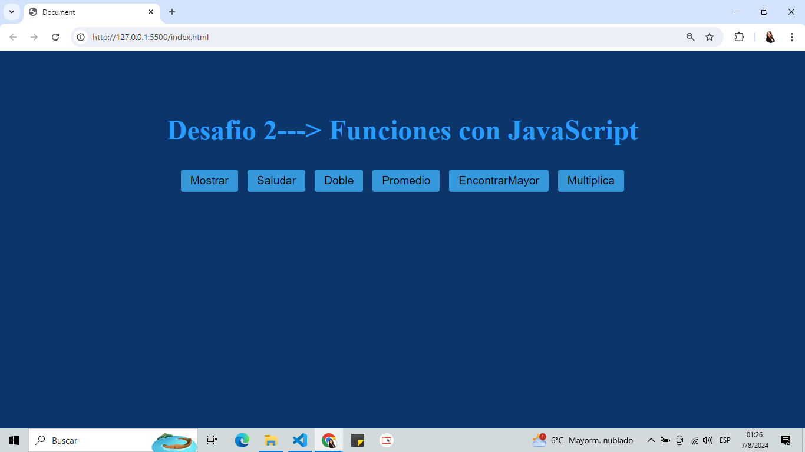

# Desafío 2: Funciones con JavaScript

## Descripción del Proyecto

Este desafio consiste en la implementación de diversas funciones en JavaScript para mostrar mensajes, solicitar datos al usuario y realizar cálculos básicos. A continuación, se describen las funciones utilizadas y sus respectivas operaciones.

## Funciones Utilizadas

### 1. Función para Mostrar "¡Hola, mundo!" en la Consola

📢 **Función:** `mostrarFunction`

Esta función muestra un mensaje de alerta con el texto "¡Hola, mundo!" cuando se ejecuta. 

### 2. Función para Saludar con un Nombre

👤 **Función:** `saludarFunction`

Esta función solicita al usuario que ingrese su nombre mediante un cuadro de diálogo `prompt` y luego muestra un mensaje de saludo con el nombre ingresado utilizando `alert`.

### 3. Función para Doblar un Número

🔢 **Función:** `doblarNumero`

Esta función solicita al usuario que ingrese un número mediante `prompt`, verifica si el valor ingresado es un número válido y, de ser así, muestra el doble de ese número utilizando `alert`. Si el valor ingresado no es válido, muestra un mensaje de error.

### 4. Función para Calcular el Promedio de Tres Números

📊 **Función:** `calcularPromedio`

Esta función solicita al usuario que ingrese tres números mediante `prompt`, verifica si los valores ingresados son válidos y, de ser así, calcula y muestra el promedio de los tres números utilizando `alert`.

### 5. Función para Encontrar el Mayor de Dos Números

📈 **Función:** `encontrarMayor`

Esta función solicita al usuario que ingrese dos números mediante `prompt`, compara los dos números y muestra el mayor de ellos utilizando `alert`.

### 6. Función para Multiplicar un Número por Sí Mismo

✖️ **Función:** `multiplicaFunction`

Esta función solicita al usuario que ingrese un número mediante `prompt`, verifica si el valor ingresado es un número válido y, de ser así, calcula y muestra el resultado de multiplicar el número por sí mismo utilizando `alert`. Si el valor ingresado no es válido, muestra un mensaje de error.

## Interfaz de Usuario

La interfaz de usuario incluye botones que, al ser presionados, ejecutan las funciones descritas anteriormente. Cada botón está asociado con una función específica para realizar las operaciones mencionadas.

---

## Cómo Ejecutar el Proyecto

Para ejecutar este proyecto, simplemente abre el archivo `index.html` en un navegador web y haz clic en los botones correspondientes para probar cada función.

## Autor
Desarrollado por Gonzalez Silvia.

Siéntete libre de ajustar los detalles según tu implementación y preferencias específicas.
Este proyecto fue desarrollado como parte del Desafío 2 con JavaScript.